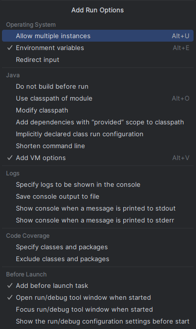

## How to configure the Run/Debug

1. Prerequisites:
   1. Visual Paradigm Installed (take note of the installation folder path).
   2. JDK 17,21 or other LTS version, configured in intelJ.
   3. Maven installed and configured.
2. Add Visual Paradigm Libraries:\
   IntelliJ needs to recognize the VP classes (such as the RV class).
   1. Go to ***File > Project Structure > Libraries***.
   2. Click the + button (Java).
   3. Navigate to the Visual Paradigm installation folder, enter the **lib** folder, and select the **vpplatform.jar** file.
   4. Click OK to apply.
3. Configure Run/Debug in IntelliJ:\
   To open Visual Paradigm and load your code in real time
   1. In the top menu, go to ***Run > Edit Configurations***.
   2. Click the + button and select **Application**.
   3. Fill in the fields according to the table:

   | Property | Value |
   | :--- | :--- |
   | **Main class** | `RV` |
   | **VM options** | `-Xms256m -Xmx768m` |
   | **Program arguments** | `debug` |
   | **Working directory** | *[Path to the bin folder inside VP's installation folder]* |

4. Click on the ***Modify options*** link and check the options as shown in the image:\

5. In the Before launch section (at the bottom of the window):
   1. Ensure that the Maven Goal is listed below "Build" in the list.
   2. Click the ***+*** button and select ***Run Maven Goal***.
   3. In the **Command line** field, type: `clean install`.

6. How to Run
   1. To simply run: Click the **Play** icon (green triangle).
   2. To debug: Place a breakpoint in your code and click the **Debug** icon (bug). 
Visual Paradigm will open automatically; execute the plugin's functionality, and IntelliJ will intercept the execution.
